<div align="center">


<h1>FinOps Culture Playbook</h1>

<p><strong>The Institutional-Grade Platform for Cultural Transformation, Cross-Functional Accountability, and Global FinOps Enablement Orchestration.</strong></p>

[]()
[]()
[]()

<br/>

> **"Industrializing cloud economics to automate cultural accountability."** 
> **FinOps Culture Playbook** is an enterprise-grade platform designed to provide a secure, measurable, and highly automated foundation for global cloud cultural operations. It orchestrates the complex lifecycle of cultural transformation—from assessment and awareness to distributed enablement and unified cultural auditing.

</div>

---

## 🏛️ Executive Summary

Fragmented cultural silos and manual enablement workflows are strategic operational liabilities; lack of centralized cultural orchestration is a primary barrier to organizational FinOps maturity. Organizations fail to maintain a secure behavioral foundation not because of a lack of training, but because of fragmented cultural standards, lack of automated engagement validation, and an inability to orchestrate cultural planes with operational precision.

This platform provides the **Cultural Intelligence Plane**. It implements a complete **Enterprise Culture-as-Code Framework**, enabling Leadership and Engineering teams to manage global cloud behavior as first-class citizens. By automating the identification of engagement bottlenecks through real-time telemetry analysis and orchestrating the deployment of secure behavior-driven enablement policies, we ensure that every organizational service—from core developer guilds to distributed executive leadership—is governed by default, audited for history, and strictly aligned with institutional cultural frameworks.

---

## 📐 Architecture Storytelling: Principal Reference Models

### 1. Principal Architecture: Global FinOps Culture & Organizational Intelligence Plane
This diagram illustrates the end-to-end flow from cultural assessment ingestion and multi-cloud orchestration to enablement enforcement, safety validation, and institutional cultural auditing.

```mermaid
graph LR
    %% Subgraph Definitions
    subgraph CultureIngress["Leadership & Team Engagement Ingress"]
        direction TB
        Executive_Sponsorship["Exec / Board / VP Updates"]
        Engineering_Guilds["Dev / Ops / SRE FinOps Guilds"]
        Business_Units["Product / Finance / Sales Alignment"]
    end

    subgraph IntelligenceEngine["Cultural Intelligence Hub"]
        direction TB
        API["FastAPI Culture Gateway"]
        EnablementOrchestrator["Global Awareness & Training Hub"]
        BehaviorGuard_Hub["Accountability & Language Hub"]
        Engagement_Validator["Engagement & Drift Analysis Hub"]
    end

    subgraph OperationsPlane["Distributed Enablement Fleet"]
        direction TB
        RegionalCoE["Managed Global Centers of Excellence"]
        LocalGuilds["Managed Regional FinOps Guilds"]
        TrainingWorkers["Managed Automated Training Workers"]
    end

    subgraph OperationsHub["Institutional Cultural Hub"]
        direction TB
        Scorecard["Cultural Maturity Scorecard"]
        Analytics["Engagement Flow & Adoption Stats"]
        Audit["Forensic Cultural Metadata Lake"]
    end

    subgraph DevOps["Culture-as-Code Framework"]
        direction TB
        TF["Terraform Enablement Modules"]
        DriftBot["Behavior & Config Drift Validator"]
        ChatOps["Culture Operations Hub"]
    end

    %% Flow Arrows
    CultureIngress -->|1. Submit Engagement| API
    API -->|2. Orchestrate Enablement| EnablementOrchestrator
    EnablementOrchestrator -->|3. Apply Behavior Policy| BehaviorGuard_Hub
    BehaviorGuard_Hub -->|4. Assess Drift| Engagement_Validator
    
    Engagement_Validator -->|5. Execute Provision| OperationsPlane
    OperationsPlane -->|6. Notify Status| ChatOps
    API -->|7. Visualize Health| Scorecard
    
    Scorecard -->|8. Track Maturity| Analytics
    Scorecard -->|9. Record Provision| Audit
    
    TF -->|10. Provision Backbone| IntelligenceEngine
    DriftBot -->|11. Inject Cultural Risk| EnablementOrchestrator
    Audit -->|12. Improve Operations| RegionalCoE

    %% Styling
    classDef ingress fill:#f5f5f5,stroke:#616161,stroke-width:2px;
    classDef intel fill:#e8eaf6,stroke:#1a237e,stroke-width:2px;
    classDef operations fill:#e1f5fe,stroke:#01579b,stroke-width:2px;
    classDef ops fill:#ede7f6,stroke:#311b92,stroke-width:2px;
    classDef devops fill:#e8f5e9,stroke:#1b5e20,stroke-width:2px;

    class CultureIngress ingress;
    class IntelligenceEngine intel;
    class OperationsPlane operations;
    class OperationsHub ops;
    class DevOps devops;
```

### 2. The FinOps Cultural Transformation Lifecycle
The continuous path of a cultural initiative from initial assess (culture) and evangelize (awareness) to active enable (training), institutionalize (process), and institutional forensic auditing.

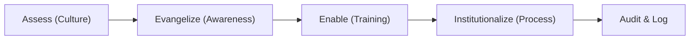

### 3. Distributed FinOps Enablement Topology
Strategically orchestrating cultural change across global business units, regional technology hubs, and decentralized product teams, providing a unified institutional view of global cloud health and behavioral readiness.

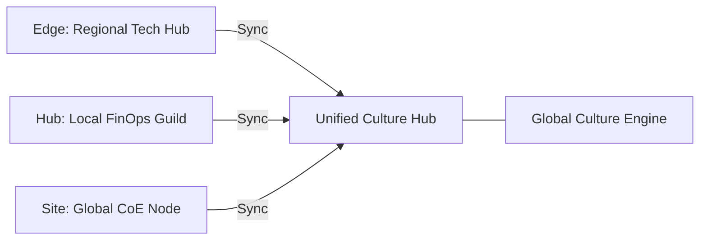

### 4. Cross-Functional Collaboration & Accountability Flow
Executing complex logic for securing the bridge between Engineering, Finance, and Business teams, ensuring every organizational identity is verified and every behavioral access is according to institutional standards.

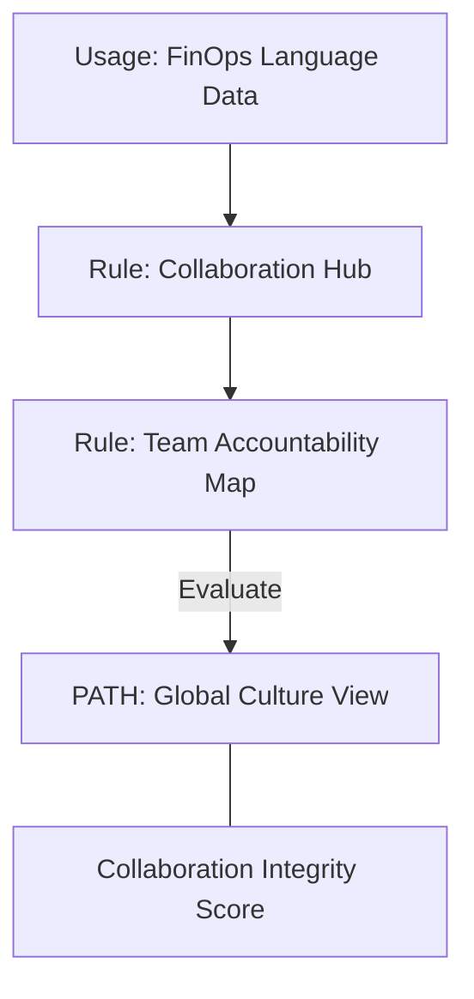

### 5. Multi-Cloud FinOps Community & Governance Flow
Automatically managing unified cultural standards across global centers of excellence and local FinOps guilds, ensuring institutional data residency and security boundaries by default.

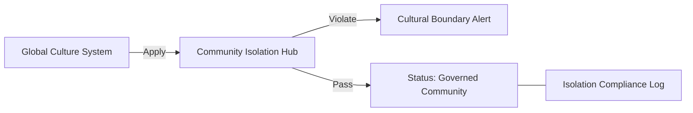

### 6. Encryption & Data Plane Protection Flow (Privacy Standard)
Managing the lifecycle of a personnel record, automatically enforcing institutional privacy standards for sensitive cultural data as required by security policy, ensuring zero-latency security confidence.

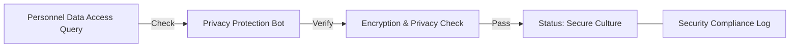

### 7. Institutional FinOps Maturity Scorecard
Grading organizational performance based on key indicators: Cultural Adoption Grade, Collaboration Frequency Index, and Training Coverage Index.

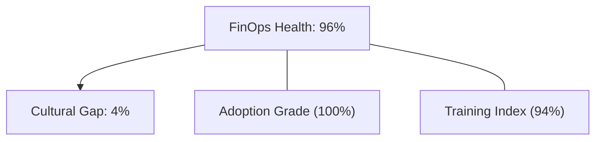

### 8. Identity & RBAC for Cultural Governance
Managing fine-grained access to cultural hubs, provisioning workers, and audit logs between FinOps Evangelists, Engineering Leads, and Finance Business Partners.

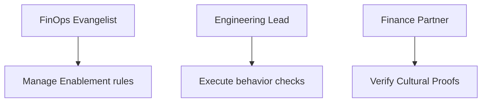

### 9. IaC Deployment: Culture-as-Code Framework
Using modular Terraform to deploy and manage the versioned distribution of the culture tracking hubs, enablement protection workers, and forensic metadata lakes.

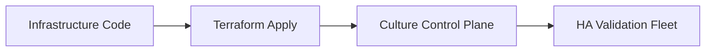

### 10. AIOps Cultural Drift & Engagement Validation Flow
Using advanced analytics to identify sudden drops in FinOps engagement, training participation anomalies, suspicious behavioral shifts, or unusual cultural pattern changes that could result in institutional risk.

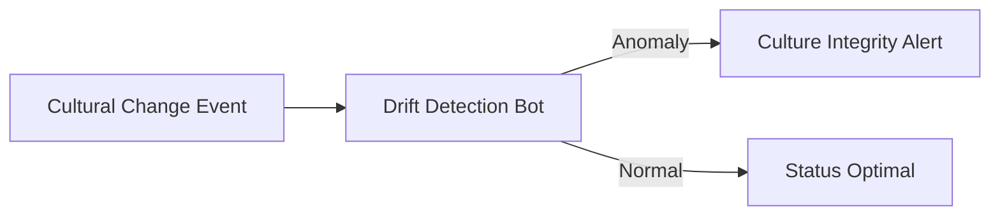

### 11. Metadata Lake for Forensic Cultural Audit
Storing long-term records of every training session (metadata), every collaboration event recorded, and every cultural milestone for institutional record-keeping, compliance auditing, and post-provisioning forensics.

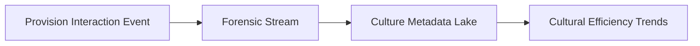

---

## 🏛️ Core Governance Pillars

1.  **Unified Foundation Coordination**: Maximizing resilience by centralizing all cultural measurement through a single institutional plane.
2.  **Automated Awareness Provisioning**: Eliminating "manual training" scenarios through proactive orchestration and pattern verification.
3.  **Sequential Behavior Intelligence**: Ensuring zero-interruption operations through dependency-aware behavior-driven enablement engineering.
4.  **Zero-Trust Cultural Protection**: Automatically enforcing identity-based access and rule evaluation across all cultural tiers.
5.  **Autonomous Operations Logic**: Guaranteeing reliability through automated industry-specific cultural monitoring runbooks.
6.  **Full Cultural Auditability**: Immutable recording of every enablement change and behavior provision for institutional forensics.

---

## 🛠️ Technical Stack & Implementation

### Culture Engine & APIs
*   **Framework**: Python 3.11+ / FastAPI.
*   **Engagement Engine**: Custom Python-based logic for multi-cloud cultural provisioning and DORA-style adoption metrics.
*   **Integrations**: Native connectors for FinOps Foundation Framework, NIST Learning Standards, and ISO 10015.
*   **Persistence**: PostgreSQL (Culture Ledger) and Redis (Live Engagement State).
*   **Auth Orchestrator**: Federated OIDC/SAML for least-privilege cultural management access.

### Governance Dashboard (UI)
*   **Framework**: React 18 / Vite.
*   **Theme**: Dark, Teal, Indigo (Modern high-fidelity behavioral aesthetic).
*   **Visualization**: D3.js for cultural topologies and Recharts for adoption velocity analytics.

### Infrastructure & DevOps
*   **Runtime**: AWS EKS or Azure Kubernetes Service (AKS) for management plane.
*   **Culture Hub**: Managed event sourcing for immutable cultural security timeline reconstruction.
*   **IaC**: Modular Terraform for deploying the FinOps landing zone and validation fleet.

---

## 🏗️ IaC Mapping (Module Structure)

| Module | Purpose | Real Services |
| :--- | :--- | :--- |
| **`infrastructure/culture_hub`** | Central management plane | EKS, PostgreSQL, Redis |
| **`infrastructure/enablers`** | Distributed enablement provisioners | Regional Guilds, Training APIs |
| **`infrastructure/culture_pipes`** | Cultural Ingestion Hubs | Webhooks, Lambda |
| **`infrastructure/auditing`** | Forensic cultural sinks | S3, Athena, Quicksight |

---

## 🚀 Deployment Guide

### Local Principal Environment
```bash
# Clone the landing zone platform
git clone https://github.com/devopstrio/finops-culture-playbook.git
cd finops-culture-playbook

# Configure environment
cp .env.example .env

# Launch the FinOps stack
make init

# Trigger a mock cultural intake and automated engagement validation simulation
make simulate-culture
```

Access the Management Portal at `http://localhost:3000`.

---

## 📜 License
Distributed under the MIT License. See `LICENSE` for more information.

---
<div align="center">
  <p>© 2026 Devopstrio. All rights reserved.</p>
</div>
