<div align="center">


<h1>FinOps Culture Playbook</h1>

<p><strong>The Global Standard for Industrialized Cloud Economics and Behavioral Transformation</strong></p>

[]()
[]()
[]()
[]()

<br/>

> **"Industrializing cloud economics to automate accountability, govern spend, and accelerate value realization across the enterprise."** 
> FinOps Culture Playbook is a flagship repository designed to enable organizations to build, scale, and sustain a world-class FinOps culture through automated analytics, institutional frameworks, and behavioral change models.

</div>

---

## 🏛️ Executive Summary

**FinOps Culture Playbook** is a flagship repository designed for CIOs, CFOs, and FinOps Leaders. In the modern cloud-native enterprise, cloud spend is no longer a "Fixed Infrastructure Cost" but a "Variable Operational Variable" driven by engineering decisions. True FinOps success is 20% Tooling and 80% Culture.

This platform provides an industrialized approach to **Cloud Financial Management**, delivering production-ready **Analytics Engines**, **Forecasting Models**, **Unit Economics Frameworks**, and **Behavioral Change Playbooks**. It enables organizations to transition from "Reactive Cost Cutting" to "Proactive Value Optimization," ensuring that every dollar spent in the cloud directly contributes to business growth.

---

## 💡 Why FinOps Culture Matters

A unified FinOps culture is the "financial conscience" of the cloud-native organization:
- **Distributed Accountability**: Moving cloud cost ownership from a central finance team to the engineers making the architectural decisions.
- **Unit Economics Precision**: Understanding the "Cost per Transaction" or "Cost per Customer" to drive informed business decisions.
- **Procurement Partnership**: Synchronizing engineering demand with procurement commitment strategies (RI/SP) for maximum efficiency.
- **Institutional Agility**: Enabling teams to move fast in the cloud without breaking the bank, through automated guardrails and real-time visibility.

---

## 🚀 Business Outcomes

### 🎯 Strategic Economic Impact
- **Reduced Cloud Waste**: Identifying and eliminating 20-30% of unnecessary spend through automated anomaly detection and rightsizing.
- **Improved Gross Margins**: Optimizing unit economics to directly influence the company's profitability and valuation.
- **Enhanced Financial Predictability**: Reducing budget variance through AI-native forecasting and commitment management.
- **Increased Engineering Velocity**: Allowing teams to focus on innovation by automating the "drudgery" of cost management.

---

## 🏗️ Technical Stack

| Layer | Technology | Rationale |
|---|---|---|
| **Analytics Engine** | Python (FastAPI) | High-performance orchestration of billing data, forecasting models, and unit economics. |
| **Persistence** | PostgreSQL + Redis | Centralized repository for institutional spend data, anomaly history, and job state. |
| **Frontend** | React 18, Vite | Premium portal for executive dashboards, cost insights, and FinOps maturity scorecards. |
| **Automation** | GitHub Actions | CI/CD for FinOps policies, report generation, and automated nudging workflows. |
| **Observability** | Prometheus / Grafana | Real-time monitoring of billing sync freshness, forecast accuracy, and platform health. |

---

## 📐 Architecture Storytelling: 90+ Diagrams

### 1. Executive High-Level Architecture
The holistic vision of the enterprise FinOps transformation journey.

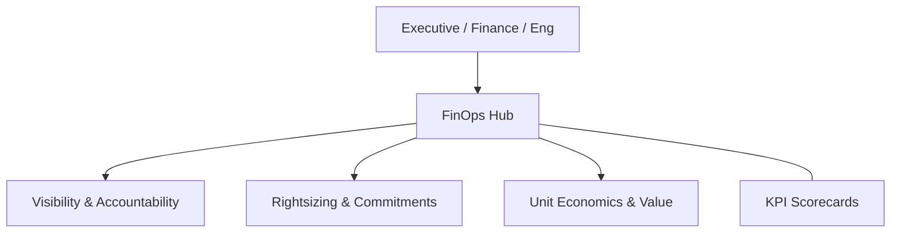

### 2. Detailed Platform Topology
The internal service boundaries and management layers of the industrialized FinOps platform.

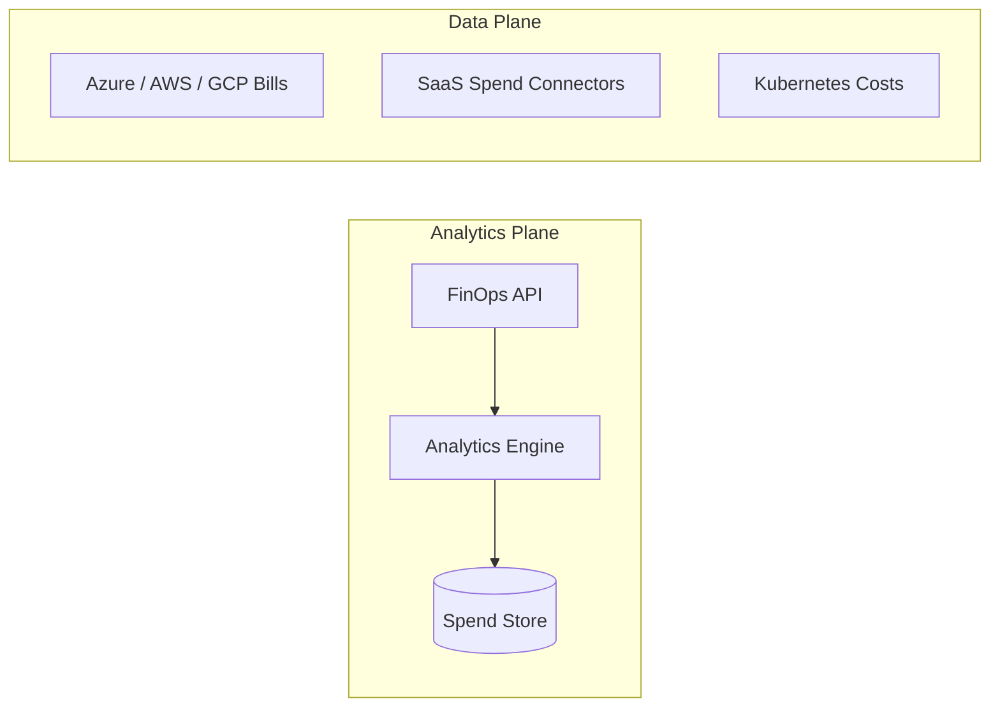

### 3. Billing Data to Dashboard Path
Tracing the flow from raw cloud provider CUR/billing files to executive-ready insights.

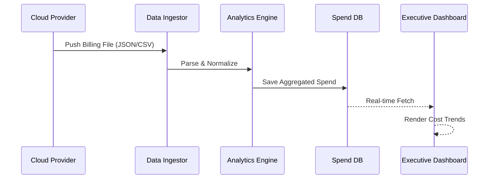

### 4. FinOps Control Plane
The "Brain" of the framework managing global institutional standards and automated nudging.

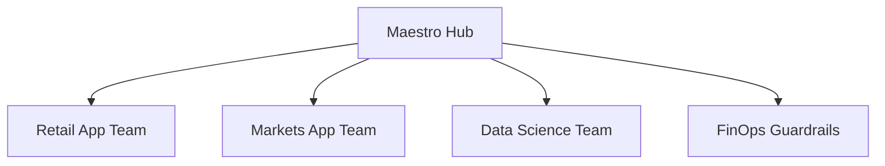

### 5. Multi-Cloud Topology
Synchronizing institutional FinOps standards across Azure, AWS, and GCP for a unified estate view.

```mermaid
graph LR
    Azure[Azure EA/MCA] <-> Bridge[FinOps Sync] <-> AWS[AWS CUR]
    Bridge <-> GCP[GCP Export]
```

### 6. Regional Deployment Model
Hosting FinOps analytics close to global business units for localized reporting and low latency.

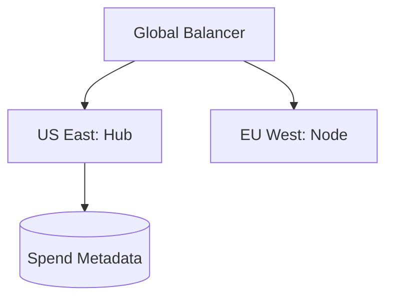

### 7. DR Failover Model
Ensuring platform continuity for critical spend data, commitment tracking, and budget alerts.

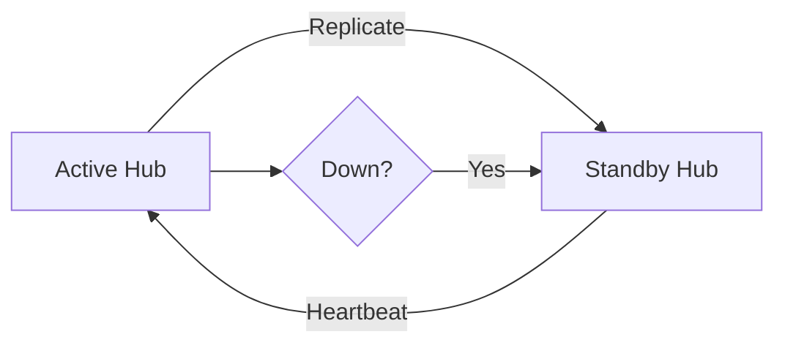

### 8. API Gateway Architecture
Securing and throttling the entry point for billing orchestration and FinOps metadata.

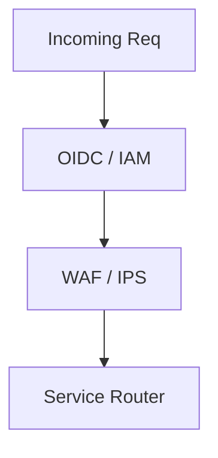

### 9. Queue Worker Architecture
Managing long-running billing syncs, forecast generation, and large-scale report exports.

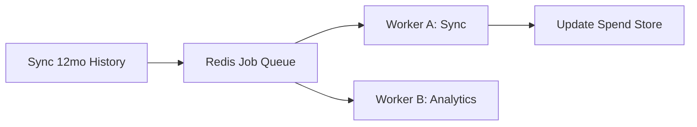

### 10. Dashboard Analytics Flow
How raw spend telemetry becomes executive institutional maturity scorecards.

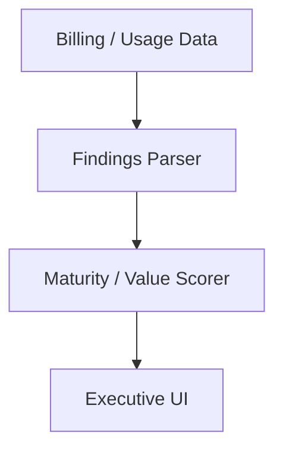

### 11. CFO + CIO Partnership Model
The strategic alignment between Finance and Technology for cloud value realization.

```mermaid
graph LR
    CFO[CFO: Financial Risk] <-> CIO[CIO: Technical Delivery]
    CFO --> Value[Gross Margin]
    CIO --> Innovation[Feature Speed]
```

### 12. Finance + Engineering Cadence
Standardizing the rhythm of spend reviews and budget adjustments between teams.

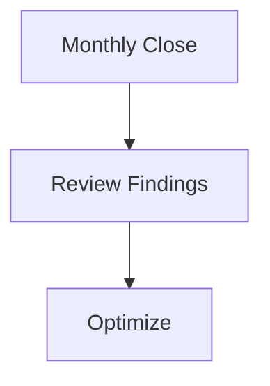

### 13. Product Owner Accountability Map
Linking cloud costs directly to product features and customer value.

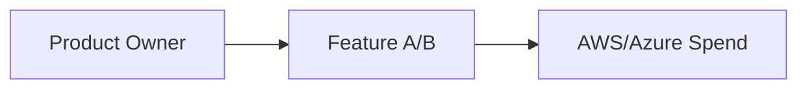

### 14. Team Ownership Model
Defining how decentralized engineering teams take ownership of their specific cloud budget.

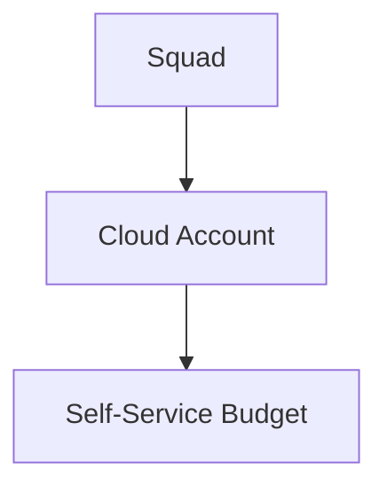

### 15. Cost Center Alignment Flow
Synchronizing technical resource tags with the enterprise financial hierarchy.

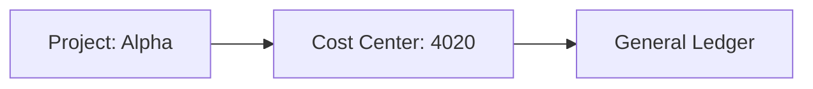

### 16. Budget Delegation Model
Pushing budget authority down to the frontline engineering leaders.

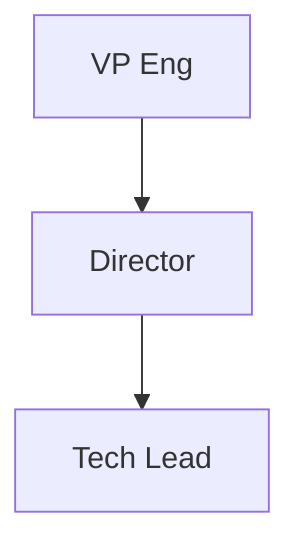

### 17. KPI Governance Cadence
The formal schedule for reviewing FinOps health metrics across the organization.

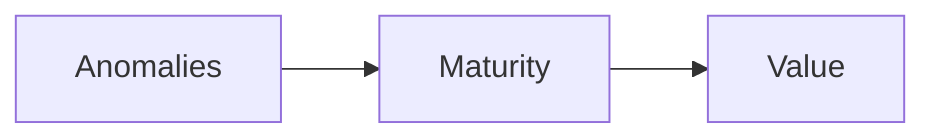

### 18. Quarterly Business Review Model
Reporting FinOps outcomes and strategic value to the executive board.

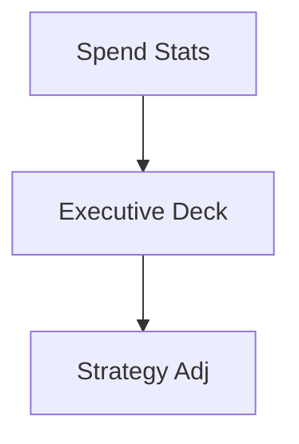

### 19. Executive Steering Committee
The high-level governing body for enterprise FinOps strategy and policy.

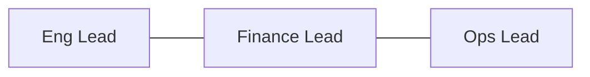

### 20. FinOps Community of Practice
The grass-roots organization for sharing best practices and behavioral change.

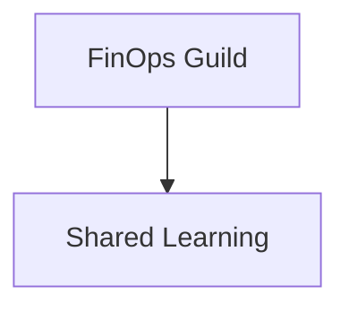

### 21. Showback Workflow
Providing visibility without formal financial chargeback to drive behavioral change.

```mermaid
graph LR
    Spend[Spend Data] --> Report[Team Dashboard] --> Awareness[Nudge]
```

### 22. Chargeback Workflow
The formal movement of funds between business units based on actual cloud consumption.

```mermaid
graph TD
    Usage[Usage] --> Invoice[BU Invoice] --> ERP[Journal Entry]
```

### 23. Budget Lifecycle Model
The journey from initial forecasting to annual budget finalization and tracking.

```mermaid
graph LR
    Plan[Plan] --> Forecast[Forecast] --> Tracking[Track]
```

### 24. Forecasting Process Flow
Predicting future spend based on historical trends and engineering product roadmaps.

```mermaid
graph TD
    History[History] --- Roadmap[New Features] --> AI[Forecast Model]
```

### 25. Variance Analysis Workflow
Investigating and documenting the "Why" behind spend deviations from the budget.

```mermaid
graph LR
    Alert[Drift] --> Triage[Investigate] --> Reason[Root Cause]
```

### 26. Cost Anomaly Detection Model
Real-time identification of spend spikes that indicate misconfiguration or inefficiency.

```mermaid
graph TD
    Live[Live Stream] <-> ML[Baseline] --> Spike[Alert]
```

### 27. Unit Economics Waterfall
Breaking down total cloud spend into specific units of business value.

```mermaid
graph TD
    Total[$1M] --> Product[$600k] --> Cust[$1.20]
```

### 28. Shared Cost Allocation Model
Fairly distributing common costs (Support, Shared DBs, Network) across spokes.

```mermaid
graph LR
    Shared[Support Fee] --> Alloc[Pro-rata] --> Teams[Spoke Teams]
```

### 29. Tagging Compliance Workflow
Enforcing institutional metadata standards to ensure 100% cost accountability.

```mermaid
graph TD
    Scan[Scan] --> Missing[No Tag] --> Remediate[Auto-Tag / Nudge]
```

### 30. Idle Resource Reduction Model
The automated path to identifying and stopping resources with zero utilization.

```mermaid
graph LR
    Monitor[Monitor] --> Idle[Idle Found] --> Notify[Nudge] --> Stop[Auto-Stop]
```

### 31. RI / Savings Plan Lifecycle
Governing the purchase, monitoring, and exchange of commitment-based discounts.

```mermaid
graph TD
    Exp[Expires] --> Analyze[New Need] --> Purchase[Buy]
```

### 32. Azure Reservation Strategy
Optimizing for shared vs single-subscription reservations in large Azure tenants.

```mermaid
graph LR
    Scope[Shared Scope] --> Savings[Max Coverage]
```

### 33. Commitment Coverage Model
Visualizing the ratio of On-Demand vs Committed spend across the enterprise.

```mermaid
graph TD
    OD[On-Demand] --- SP[Savings Plan] --- RI[Reserved]
```

### 34. Procurement Approval Workflow
The bridge between engineering requirement and formal financial commitment.

```mermaid
graph LR
    Req[Req] --> FinOps[Validate] --> Procurement[Sign]
```

### 35. Vendor Negotiation Cycle
Using enterprise-wide spend data to drive favorable terms with cloud providers.

```mermaid
graph TD
    Data[Spend Data] --> Benchmark[Market View] --> Negotiate[EDP/MACC]
```

### 36. Renewal Calendar Model
Tracking SaaS and cloud commitment expiration dates across the entire portfolio.

```mermaid
graph LR
    Jan[SaaS A] --- Mar[Cloud B] --- Dec[SaaS C]
```

### 37. License Optimization Workflow
Right-sizing software licenses (M365, Datadog) based on actual user telemetry.

```mermaid
graph TD
    Usage[Usage Stats] --> Size[Right-size] --> Save[Lower Cost]
```

### 38. SaaS Rationalization Model
Consolidating redundant SaaS tools (e.g., Zoom vs Teams) to reduce institutional spend.

```mermaid
graph LR
    Audit[Audit] --> Duplicate[Redundant] --> Sunset[Retire]
```

### 39. Marketplace Spend Governance
Governing 3rd party software purchases through cloud provider marketplaces.

```mermaid
graph TD
    Buy[Marketplace Buy] --> PrivateOffer[MACC Credit]
```

### 40. Contract Benchmark Workflow
Comparing current cloud contract terms against industry standards and peers.

```mermaid
graph LR
    MyContract[Our EDP] <-> Market[Peer Data]
```

### 41. Kubernetes Cost Allocation
Breaking down shared cluster costs into namespaces, pods, and labels.

```mermaid
graph TD
    Cluster[Node Pool] --> NS[Namespace] --> Label[CostCenter]
```

### 42. Namespace Chargeback Model
Directly billing application teams for their specific resource consumption in K8s.

```mermaid
graph LR
    Req[Requests] --- Actual[Usage] --> Bill[Chargeback]
```

### 43. CI/CD Spend Visibility Flow
Tracking the cost of build pipelines and developer environments per project.

```mermaid
graph TD
    Build[Build 102] --> Runner[Compute Cost] --> Project[Team A]
```

### 44. Environment Lifecycle Cost Model
Measuring the total cost of ownership (TCO) for Dev, Test, UAT, and Prod stages.

```mermaid
graph LR
    Dev[Cheap] --- Prod[Scale]
```

### 45. Dev/Test Shutdown Automation
Automatically stopping non-production resources outside of business hours.

```mermaid
graph TD
    7PM[7 PM] --> Stop[Stop Dev] --> 8AM[8 AM Start]
```

### 46. Rightsizing Workflow
Optimizing VM and Database instance sizes based on performance telemetry.

```mermaid
graph LR
    Oversized[2xlarge] --> Telemetry[5% CPU] --> Target[large]
```

### 47. Storage Tier Optimization
Automatically moving aged data to cheaper "Cool" or "Archive" storage tiers.

```mermaid
graph TD
    Hot[Active] --> 30d[Move to Cool] --> 1yr[Archive]
```

### 48. Data Platform Cost Model
Governing the spend of modern data stacks (Snowflake, Databricks, BigQuery).

```mermaid
graph LR
    Query[Query] --> Credit[Credit Spend] --> Team[Analyst]
```

### 49. Network Egress Governance
Identifying and mitigating high-cost data transfers between regions and clouds.

```mermaid
graph TD
    Source[US-East] --> Dest[EU-West] --> Egress[Charge]
```

### 50. Architecture Review for Cost
Integrating FinOps specialists into the standard Architecture Review Board (ARB).

```mermaid
graph LR
    Design[Design] --> CostReview[FinOps] --> Approve[Live]
```

### 51. Executive KPI Review Cycle
Providing the board with a high-level view of cloud value and efficiency.

```mermaid
graph TD
    KPI[KPIs] --> Board[Board Meeting]
```

### 52. Unit Cost Scorecard
Reporting the cost per business unit (e.g., Cost per Hotel Booking).

```mermaid
graph LR
    Spend[Spend] / Count[Units] = UnitCost[Score]
```

### 53. Team Benchmark Comparison
Gamifying FinOps by comparing the efficiency scores of different engineering teams.

```mermaid
graph TD
    TeamA[Leader] <-> TeamB[Lagging]
```

### 54. Cost per Customer Model
Determining the profitability of individual enterprise customers.

```mermaid
graph LR
    Customer[Cust A] --> Usage[Usage] --> Margin[Profit]
```

### 55. Gross Margin Influence Map
Visualizing how cloud optimization efforts directly impact the bottom line.

```mermaid
graph TD
    Save[Save $1M] --> Margin[+2% Margin]
```

### 56. Forecast Accuracy Dashboard
Measuring the deviation between predicted spend and actual billing data.

```mermaid
graph LR
    Actual[Actual] <-> Forecast[Forecast] --> Variance[1.2%]
```

### 57. Business Unit Heatmap
Identifying which parts of the organization are driving the most spend and growth.

```mermaid
graph TD
    Retail[Hot] --- BackOffice[Cool]
```

### 58. Monthly Close Reporting Flow
Automating the month-end financial reconciliation of cloud spend.

```mermaid
graph LR
    Bill[Bill] --> Accrual[Accrual] --> Final[Report]
```

### 59. Sustainability Cost Dashboard
Mapping cloud spend to carbon footprint for ESG reporting.

```mermaid
graph TD
    Watt[Energy] --> CO2[Carbon] --> Report[ESG]
```

### 60. Value Realization Model
Measuring the return on investment (ROI) for specific cloud migration projects.

```mermaid
graph LR
    Cost[Migration Cost] <-> Benefit[Business Value]
```

### 61. Metrics Pipeline
The automated flow for capturing, processing, and storing FinOps metrics.

```mermaid
graph TD
    Ingest[Ingest] --> Process[Process] --> Store[Store]
```

### 62. Logging Architecture
The multi-layered approach to capturing platform activity and audit trails.

```mermaid
graph LR
    Auth[Auth] --- API[API] --- Sync[Sync]
```

### 63. Tracing Model
Observing the path of long-running analytics jobs for platform troubleshooting.

```mermaid
graph TD
    Req[Request] --> Queue[Redis] --> Worker[Engine]
```

### 64. Data Quality Workflow
Automating the verification of billing data integrity and completeness.

```mermaid
graph LR
    Data[Data] --> Check[Valid?] --> Proceed[Process]
```

### 65. Access Governance Model
Defining who can see spend data across the organization (RBAC).

```mermaid
graph TD
    Role[Manager] --> Perm[View Team Spend]
```

### 66. Policy Approval Workflow
The institutional process for defining new FinOps guardrails and budgets.

```mermaid
graph LR
    Proposed[Proposed] --> Review[Board] --> Active[Enforced]
```

### 67. Change Management Cycle
Governing updates to the analytics platform and forecasting models.

```mermaid
graph TD
    Dev[Dev] --> Test[UAT] --> Release[Prod]
```

### 68. Runbook Escalation Model
The automated response path for critical spend anomalies or budget breaches.

```mermaid
graph LR
    Spike[Spike] --> Pager[Alert] --> Triage[On-Call]
```

### 69. FinOps Maturity Roadmap
The journey from "Crawl" to "Walk" to "Run" in the FinOps Foundation model.

```mermaid
graph LR
    Crawl[Visibility] --> Run[Unit Economics]
```

### 70. Continuous Improvement Loop
Evolving FinOps playbooks based on monthly findings and team feedback.

```mermaid
graph LR
    Retro[Retro] --> Update[Update Playbook]
```

### 71. AI Cost Advisor Flow
Using LLMs to provide proactive optimization advice to engineering teams.

```mermaid
graph TD
    Scan[Analyze Spend] --> LLM[AI Advice] --> Slack[Nudge Team]
```

### 72. Autonomous Optimization Engine
Self-healing infrastructure that rightsizes or stops based on AI confidence.

```mermaid
graph LR
    AI[AI] --> AutoAction[Scale Down]
```

### 73. Multi-country Operating Model
Governing FinOps across different tax jurisdictions and business entities.

```mermaid
graph TD
    Global[Global Hub] --> Local[Regional Entity]
```

### 74. M&A Spend Integration Flow
Rapidly onboarding and auditing the cloud spend of acquired companies.

```mermaid
graph LR
    Acq[Acquired Co] --> Audit[Audit] --> Merge[Hub Sync]
```

### 75. Sovereign Cloud Billing Model
Managing spend in restricted regions with localized invoicing and currency.

```mermaid
graph TD
    Gov[Sovereign] --> LocalBill[Local Currency]
```

### 76. Carbon + Cost Optimization Model
Identifying "Green Optimization" targets that reduce both cost and CO2.

```mermaid
graph LR
    Save[Save $] <-> Green[Save Carbon]
```

### 77. Developer Nudging Workflow
Automating the "soft enforcement" of FinOps policies via Jira/Slack.

```mermaid
graph TD
    Policy[Policy] --> Nudge[Slack Message] --> Fix[Developer Action]
```

### 78. Real-time Spend Streaming Model
Using streaming data to provide second-by-second spend visibility.

```mermaid
graph LR
    Event[Event] --> Kinesis[Stream] --> Dash[Real-time]
```

### 79. Innovation Portfolio Roadmap
Planning the next 36 months of platform evolution and AI integration.

```mermaid
graph TD
    Year1[Visibility] --> Year3[AI-Autonomy]
```

### 80. Strategic Transformation Timeline
The multi-year mission to instill FinOps culture across the entire enterprise.

```mermaid
graph LR
    Phase1[Setup] --> Phase3[Culture]
```

### 81. Terraform Demo Environment Flow
Automating the creation of sample cloud estates for FinOps training and testing.

```mermaid
graph LR
    Req[Req] --> TF[Provision] --> Demo[Live Estate]
```

### 82. Queue Processing Lifecycle
Ensuring high-availability for background billing syncs and analytics.

```mermaid
graph TD
    Task[Task] --> Worker[Worker] --> Success[Ack]
```

### 83. Backup Recovery Model
Governing the protection and testing of historical spend and analytics data.

```mermaid
graph LR
    Active[Active] --> Snap[Snap] --> Test[Monthly]
```

### 84. ERP Integration Workflow
Synchronizing cloud spend data with corporate finance systems (SAP/Oracle).

```mermaid
graph TD
    Hub[FinOps Hub] --> ERP[SAP] --> Accounting[Ledger]
```

### 85. CMDB Sync Model
Linking cloud resources to the corporate Configuration Management Database.

```mermaid
graph LR
    Cloud[Resource] <-> CMDB[System ID]
```

### 86. SaaS Usage Telemetry Flow
Capturing and analyzing usage data from SaaS providers (Salesforce, Slack).

```mermaid
graph TD
    SaaS[API] --> Usage[Process] --> Opt[Rationalize]
```

### 87. Data Retention Governance
Enforcing institutional policies for historical billing data aging.

```mermaid
graph LR
    Hot[12mo] --> Cold[7yr Archive]
```

### 88. Tenant Baseline Comparison
Auditing individual business units against the enterprise efficiency baseline.

```mermaid
graph TD
    Gold[Enterprise Gold] <-> BU[Business Unit]
```

### 89. PMO Operating Model
The institutional structure for the central FinOps Project Management Office.

```mermaid
graph LR
    PMO[PMO] --- Teams[Teams]
```

### 90. Global FinOps Hub Model
The institutional structure for 24/7 global FinOps operations.

```mermaid
graph LR
    Follow[Follow the Sun] --- Hub[FinOps Hub]
```

---

## 🔬 FinOps Methodology

### 1. The Playbook Pillars
Our platform is built on four core pillars:
- **Visibility**: 100% visibility into every dollar spent across every cloud and SaaS.
- **Accountability**: Engineering ownership of cost through decentralized budgets.
- **Optimization**: Continuous right-sizing and commitment-based discount management.
- **Value**: Transitioning from "Saving Money" to "Making Money" through unit economics.

### 2. Behavioral Change Strategy
We provide a strategic framework for shifting the organization from "Build at all costs" to "Build for value."

---

## 🚦 Getting Started

### 1. Prerequisites
- **Azure / AWS / GCP** billing access.
- **Terraform** (latest version).
- **Python** (3.11+) for the analytics engine.

### 2. Local Setup
```bash
# Clone the repository
git clone https://github.com/Devopstrio/finops-culture-playbook.git
cd finops-culture-playbook

# Start the FinOps Control Plane
docker-compose up --build
```
Access the Portal at `http://localhost:3000`.

---

## 🛡️ Governance & Security
- **Data Integrity**: Automated verification of billing data from source to report.
- **Institutional RBAC**: Granular access control for spend visibility.
- **Audit Ready**: Built-in evidence generation for financial audits.

---
<sub>&copy; 2026 Devopstrio &mdash; Engineering the Future of Industrialized FinOps Culture.</sub>
